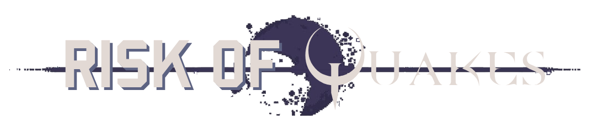

You can view a video demo here:
(TODO: VIDEO)

# How to Play
1. Go to the Risk of Quakes [itch.io page](https://shuflduf.itch.io/risk-of-quakes) for the latest releases.
2. Run Risk of Quakes
  - **Windows**:
    1. Download `RiskOfQuakes_Windows.exe`
    2. Double-click the file to open it
  - **macOS**:
    1. Download `RiskOfQuakes_MacOS.zip`
    2. Extract the zip file
    3. Move `Risk Of Quakes.app` to your Applications folder
    4. Double-click `Risk of Quakes.app` to run it
    5. If you see a security warning, click "Open" to proceed
    6. If the app doesn't start, right-click (Control-click) on it and select "Open"
    7. If you see an issue about quarantine, open Terminal and run: `xattr -dr com.apple.quarantine "~/Applications/Risk Of Quakes.app"`
  - **Linux**:
    1. Download `RiskOfQuakes_Linux.x86_64`
    2. Open the terminal in the downloads directory
    3. Make the file executable: `chmod +x RiskOfQuakes_Linux.x86_64`
    4. Run it: `./RiskOfQuakes_Linux.x86_64`
3. If you don't have any friends on your local network, you can open two instances of the game
4. Set a username
5. **Host**: Click the `Host` button, and wait for everyone to join. Once everyone has joined, select a map and click `Start Game` to start survivor selection.
6. **Player**: Click the `Connect` button and wait for the host to start survivor selection.
7. Once survivor selection has started, select your survivor.
8. Once all players have selected their survivors, the game will load and the match will begin!

# Tips
If you've never played a game with Quake movement before, here the basics:
- You should always be jumping. Being on the ground decelerates your character.
- To bhop, do NOT press the W key, instead you have to alternate between pressing A and D, and move your mouse with the direction you're moving.
  - For example, when pressing the A key, move the mouse to the left.
- Avoid making sharp mouse movements. Instead, opt for smooth, fluid movements to maximise speed.
- You can watch "[Okay, but how does airstrafing ACTUALLY work?](https://www.youtube.com/watch?v=gRqoXy-0d84&t=1349s)" to understand best practices needed to move good, and to learn how the movement system here works.

# Features
- [Quake movement](https://aneacsu.com/blog/2023-04-09-quake-movement-godot)
- Several survivors
  - [Commando](#commando)
  - [Chef](#chef)
- Complete multiplayer system
  - P2P networking
  - Lobby
  - Ready players indicators
  - Selecting maps
  - Disconnecting mid-game
- Handmade maps
  - [Skirmish A](#skirmish-a)
  - [Bulwark's Ambry](#bulwarks-ambry)
- Baked lighting
- Sensitivity & FOV settings
- Tracking kills and deaths through a leaderboard

# Survivors
## Commando
Commando is a well-rounded survivor, with high mobility and strong damage at medium range.
- **Frag Grenades** are a powerful tool in increasing your momentum, at the cost of health.
- Using **Tactical Slide** midair while not holding any movement keys automatically redirects your momentum to where you're looking. This is a powerful mobility tool.

### Skills
- **Double Tap**: Fire two guns at a medium rate, dealing 5 damage from *any range*.
- **Phase Round**: Hold down for 1-3 seconds to charge speed and damage. Release to shoot a projectile dealing 8-23 damage, *piercing through walls and enemies*.
- **Tactical Slide**: Slide on the ground for a short distance, giving a large speed boost. If used in the air, it adds extra vertical momentum depending on the current speed and *redirects your momentum*.
- **Frag Grenade**: Throw a greande that explodes in 1 second, dealing 15 damage and knocking *all characters* back.

## CHEF
CHEF has high combo potential and great time-to-kill at short ranges, at the cost of having harder to control mobility.
- Suspended cleavers from **Dice** can be used to make traps, as each cleaver does 10 damage on the return trip if suspended at all.
- Using **Boosted Dice** while inside an enemy does insane damage, and is a guaranteed kill in most cases.

### Skills
- **Dice**: Throw a piercing cleaver for 5 damage. Holding the attack key suspends any cleavers, dealing 3 damage periodically, and doubling damage on the way back.
  - **Boosted Dice**: *Throw cleavers in all directions.*
- **Sear**: Scorch enemies in front of you for 2 damage every 0.1 seconds.
  - **Boosted Sear**: *Scorch enemies further in front of you for 4 damage every 0.1 seconds.*
- **Roll**: Charge the rolling pin for 0-2 seconds to speed forward, dealing 8-16 damage when hitting an enemy.
  - **Boosted Roll**: *Charge the rolling pin for 0-2 seconds to speed forward faster while swinging cutlery, dealing 8-16 damage when hitting an enemy, and an additional 2 damage every 0.1 seconds.*
> [!NOTE]
> Boosted Roll isn't fully implemented yet, it only increases speed right now.
- **Yes, CHEF!**: Boosts the next skill used.

# Maps
## Bulwark's Ambry
The Artifact Reliquary from Risk of Rain 2, rebuilt for PvP. Featuring baked lighting and a [custom sky shader](https://godotshaders.com/shader/starry-sky/), be careful not to fall off!

*(baked lighting comparison)*

## Skirmish A
A scaled-up version of the Skirmish A map from Valorant! It's barebones, but each box was placed intentionally for cover and for bhopping on top of when you have enough speed.

*(baked lighting comparison)*

